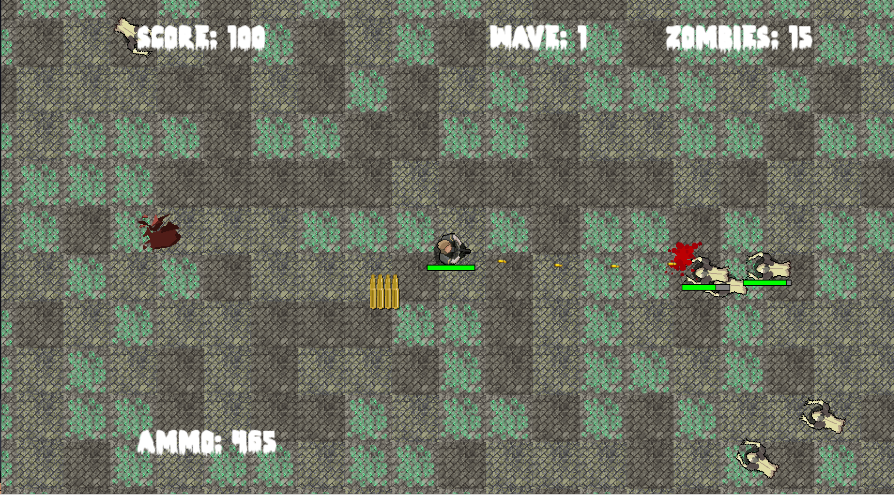

# 🧟 Zombie Arena 🧟

**Zombie Arena**는 Kyungil Game Academy의 수업 과정 중에 개발된 탑다운 슈팅 게임입니다. 플레이어는 끊임없이 몰려오는 좀비로부터 살아남아 최대한 오래 버티는 것이 목표입니다.

## 🎮 게임 특징

- **넉백 효과**: 좀비가 피격 시 넉백되며, 전략적인 전투가 가능합니다.
- **카메라 경계 제약**: 카메라가 플레이어를 따라 움직이지만, 맵의 경계를 넘어서지 않도록 제어됩니다.
- **외부 데이터 기반 좀비 생성**: 역직렬화를 통해 외부 파일에서 좀비의 생성 데이터를 불러와 설정할 수 있습니다.

## 🛠️ 빌드 방법

1. `GenerateSolution.bat` 파일을 실행하여 솔루션을 생성합니다.
2. 생성된 솔루션을 열어 프로젝트를 빌드합니다.

## 📜 저작권

이 프로젝트는 [MIT License](./LICENSE)를 따릅니다.

---

Zombie Arena는 경일 게임 아카데미 수업의 일환으로 개발되었으며, 그 외에 다음과 같은 기능을 직접 구현하였습니다:

- 피격 시 넉백 판정
- 맵 경계를 벗어나지 않는 카메라 제약
- 외부에서 정의 가능한 좀비 생성 데이터 구조화

---

즐거운 플레이 되세요! 🕹️
